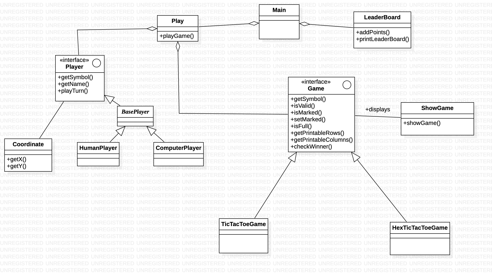
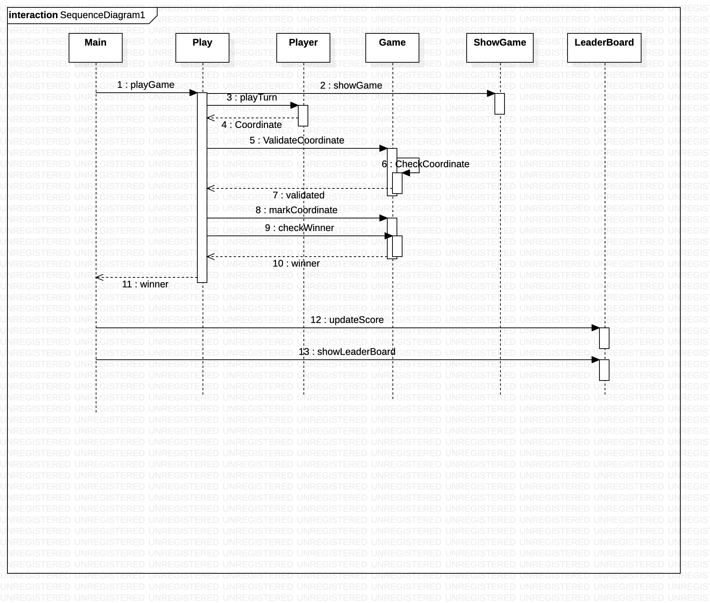

# FKApplyDesign
Run
------
To Run  
git clone https://github.com/manansingla4/FKApplyDesign.git  
cd FKApplyDesign  
git checkout Dev  
cd src  
javac *.java  
java Main  
In your terminal  
Enter Coordinates of the box and top left corner being 1 1 (Basic Coordinate Convention for Matrix)
    
 
Class Diagram
-------------

Sequence Diagram
----------------

